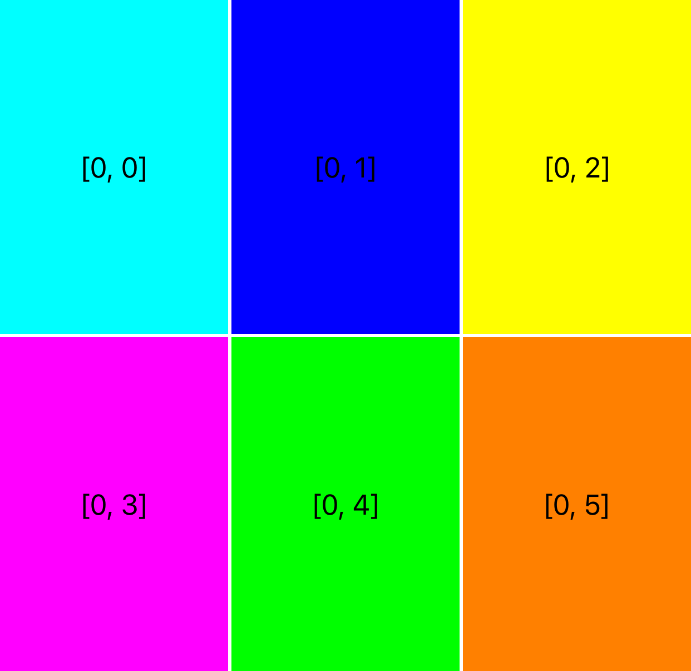
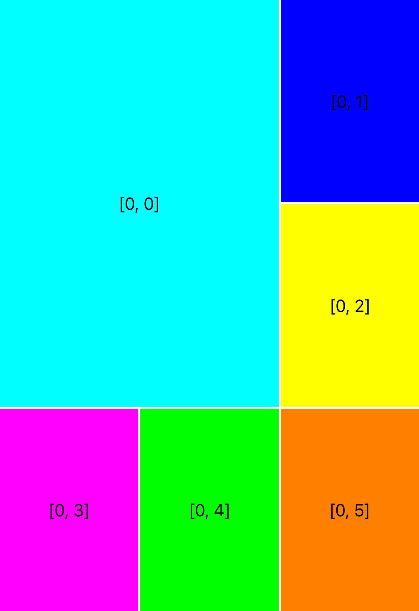
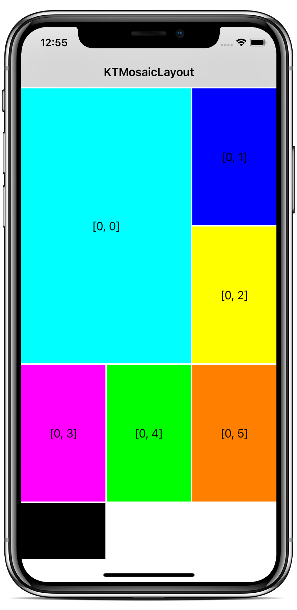
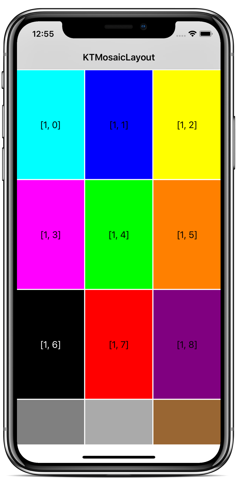
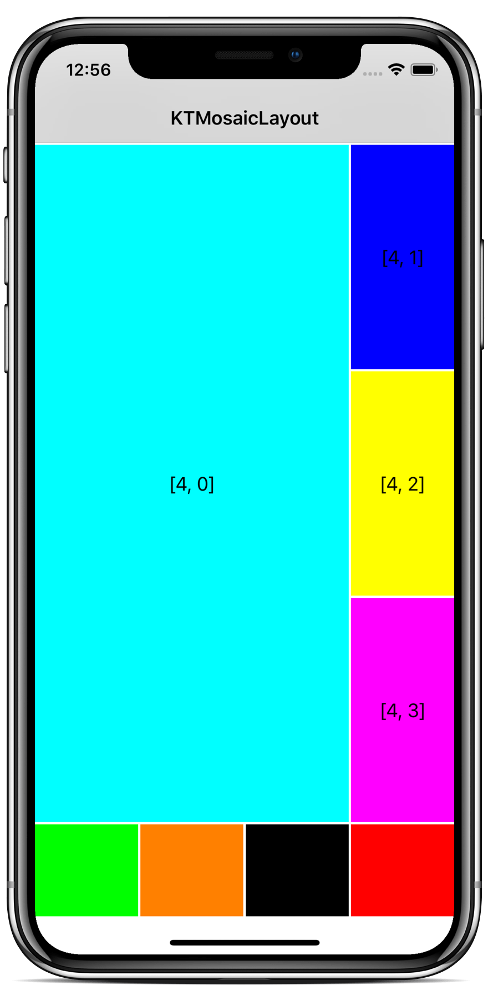

# KTMosaicLayout

<p align="center">
  
</p>


<a href="https://developer.apple.com/swift"></a>
[](http://cocoapods.org/pods/KTMosaicLayout)
[](https://github.com/Carthage/Carthage)
[](https://github.com/iKiKi/KTMosaicLayout/blob/master/LICENSE?raw=true)
[](http://twitter.com/kthoron)

**KTMosaicLayout** is a Swift `UICollectionViewLayout` being able to display `UICollectionView` items on different columns.

<p align="center"></p>

### Features

In case at least 3 columns is defined for a section, **KTMosaicLayout** can display the first item of this section in a **big** style. When a section displays the first item as **big**, it means that the first row of this section displays all the last items on a single column, to layout the first as a **big**.

<p align="center"></p>

> 💡 In case you don't really need to display big styled items in sections as illustrated above, this layout can be replaced by a usual `UICollectionViewFlowLayout`.

## 📱Example

<p align="center"></p>

> 💡 To run the [example project](https://github.com/iKiKi/KTMosaicLayout/tree/master/Example), clone the repo, pod install, and run the iOS application.

## Installation

### CocoaPods

The preferred installation method is with [CocoaPods](http://cocoapods.org). Add the following to your `Podfile`:

```ruby
pod 'KTMosaicLayout'
```

### Carthage

For [Carthage](https://github.com/Carthage/Carthage), add the following to your `Cartfile`:

```ogdl
github "iKiKi/KTMosaicLayout"
```

## Usage

You just need to set a `KTMosaicLayout` to your `UICollectionView` layout (using IB or code), set a `MosaicLayoutDelegate` to this layout and implement the necessary methods:

```swift
public protocol MosaicLayoutDelegate: class {
  func collectionView(_ collectionView: UICollectionView, numberOfColumnsInSection section: Int) -> Int
  func collectionView(_ collectionView: UICollectionView, shouldShowBigInSection section: Int) -> Bool
  func collectionView(_ collectionView: UICollectionView, heightForItemInSection section: Int) -> CGFloat // Called in case more than 1 column
  func collectionView(_ collectionView: UICollectionView, heightForItemAt indexPath: IndexPath) -> CGFloat // Called in case only 1 column

  func collectionView(_ collectionView: UICollectionView, insetForSectionAt section: Int) -> UIEdgeInsets
  func collectionView(_ collectionView: UICollectionView, minimumLineSpacingForSectionAt section: Int) -> CGFloat
  func collectionView(_ collectionView: UICollectionView, minimumInteritemSpacingForSectionAt section: Int) -> CGFloat

  func collectionView(_ collectionView: UICollectionView, referenceSizeForHeaderInSection section: Int) -> CGSize
  func collectionView(_ collectionView: UICollectionView, referenceSizeForFooterInSection section: Int) -> CGSize
}
```

> 💡 `heightForItemInSection` is called in case a section has more than 1 column. `heightForItemAt` is called in case the section has only 1 column (to layout items with different heights).

## License

`KTMosaicLayout` is released under the MIT license. [See LICENSE](https://github.com/iKiKi/KTMosaicLayout/blob/master/LICENSE) for details.
